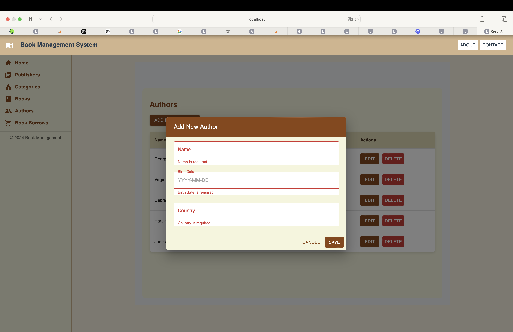

# live link
https://main--monumental-starlight-a8c6ee.netlify.app


# Library App

This is a full-stack library management application built using React.js and Vite for the frontend. It provides features such as managing books, authors, categories, publishers, and borrowing records for a library. This application is designed to be simple, fast, and efficient for managing library operations.

## Table of Contents

- [Features](#features)
- [Technologies Used](#technologies-used)
- [Getting Started](#getting-started)
- [Scripts](#scripts)
- [Folder Structure](#folder-structure)
- [API Endpoints](#api-endpoints)
- [Screenshots](#screenshots)
- [License](#license)

## Features

- **Authors Management**: Add, update, and delete authors.
- **Publishers Management**: Add, update, and delete publishers.
- **Books Management**: Add, update, and delete books.
- **Categories Management**: Add, update, and delete categories.
- **Borrowing Management**: Record when books are borrowed and returned.

## Technologies Used

- **Frontend**: React.js (with Vite as the bundler)
- **UI Framework**: Material-UI (MUI)
- **Styling**: Custom themes with Material-UI

## Getting Started

To get a local copy up and running, follow these simple steps.

### Prerequisites

- **Node.js**: Ensure you have Node.js installed (version 14.x or higher).

### Installation

1. **Clone the repository**:

    ```bash
    git clone https://github.com/yourusername/library-app.git
    ```

2. **Navigate to the project directory**:

    ```bash
    cd capstone
    ```

3. **Install dependencies**:

    ```bash
    npm install
    ```

4. **Set up environment variables**:

    Create a `.env` file in the root directory and add your MongoDB connection string:

    ```
    VITE_REACT_APP_LIBRARY_APP_BASE_URL=http://localhost:8080/api/v1
    ```

5. **Run the development server**:

    ```bash
    npm run dev
    ```
## Scripts

- **Start Development Server**: `npm run dev` - Starts the app in development mode.
- **Build for Production**: `npm run build` - Builds the app for production.
- **Preview Production Build**: `npm run preview` - Serves the production build locally.

## Folder Structure

```
capstone-project/
├── src/                 # React application source code
│   ├── components/      # React components
│   ├── pages/           # React pages
│   └── main.jsx         # Entry point for the React app
│
├── .env                 # Environment variables
├── vite.config.js       # Vite configuration
├── package.json         # Dependencies and scripts
└── README.md            # Project documentation
```

## API Endpoints

The following API endpoints are assumed for the backend. Ensure that these endpoints exist in your backend API:

- **Authors**
  - `GET /authors` - Retrieve all authors.
  - `POST /authors` - Add a new author.
  - `PUT /authors/:id` - Update an author by ID.
  - `DELETE /authors/:id` - Delete an author by ID.

- **Publishers**
  - `GET /publishers` - Retrieve all publishers.
  - `POST /publishers` - Add a new publisher.
  - `PUT /publishers/:id` - Update a publisher by ID.
  - `DELETE /publishers/:id` - Delete a publisher by ID.

- **Books**
  - `GET /books` - Retrieve all books.
  - `POST /books` - Add a new book.
  - `PUT /books/:id` - Update a book by ID.
  - `DELETE /books/:id` - Delete a book by ID.

- **Categories**
  - `GET /categories` - Retrieve all categories.
  - `POST /categories` - Add a new category.
  - `PUT /categories/:id` - Update a category by ID.
  - `DELETE /categories/:id` - Delete a category by ID.

- **Borrows**
  - `GET /borrows` - Retrieve all borrow records.
  - `POST /borrows` - Add a new borrow record.
  - `PUT /borrows/:id` - Update a borrow record by ID.
  - `DELETE /borrows/:id` - Delete a borrow record by ID.

## Screenshots

### Home 


### Authors Management
![Authors Page]



## License

This project is licensed under the MIT License. See the [LICENSE](LICENSE) file for details.
